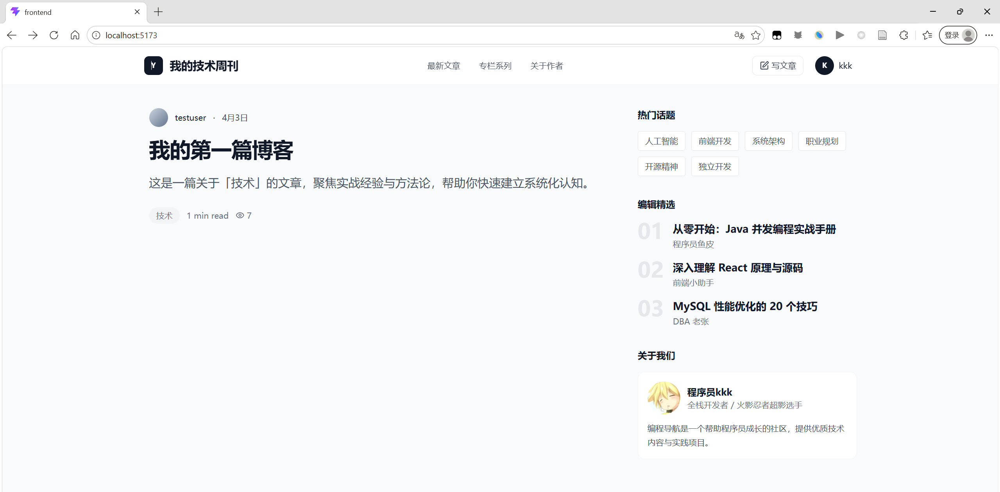
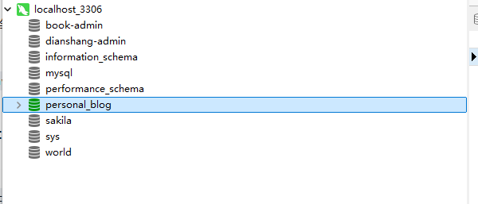
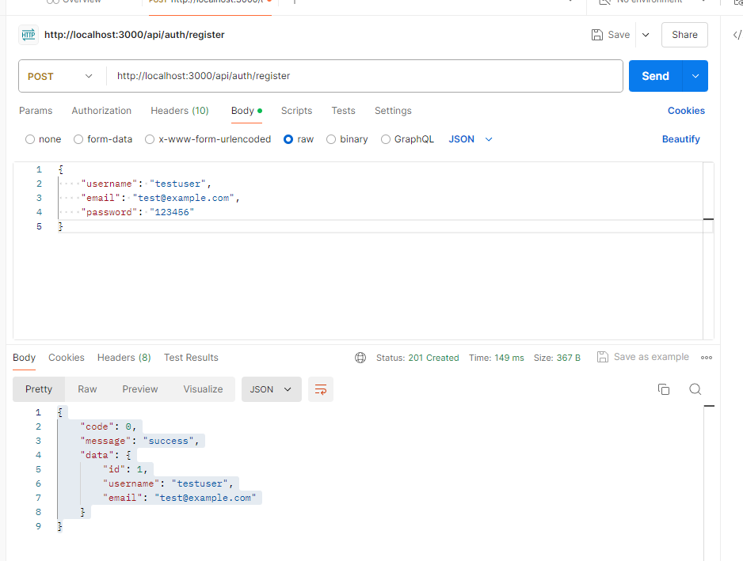
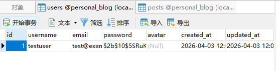
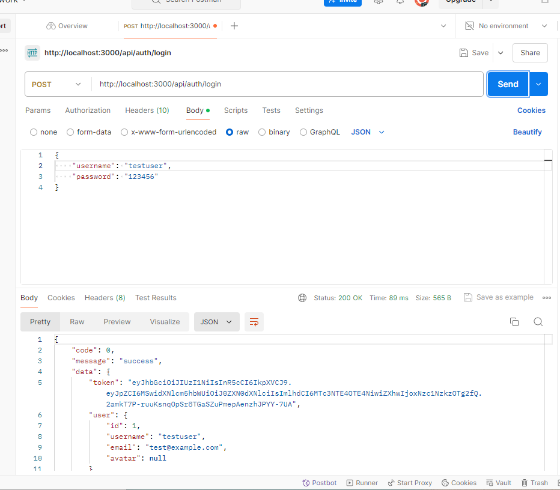
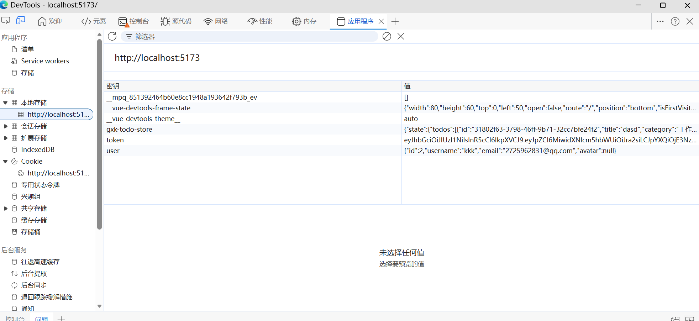
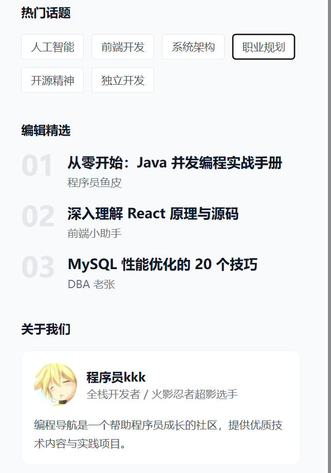
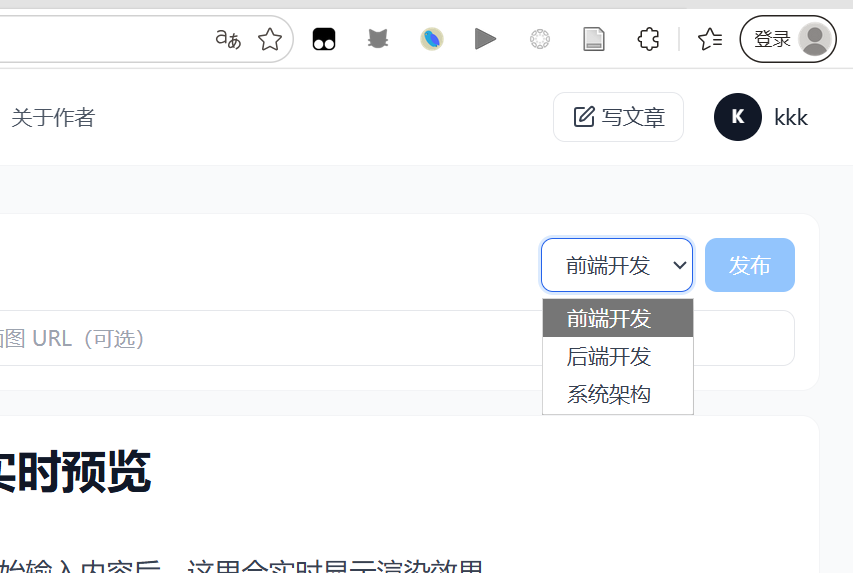

## 1全栈开发基础知识

全栈开发包括三个部分：前端（用户看到的界面）、后端（处理业务逻辑）、数据库（存储数据）。前端负责展示数据和接收用户输入，后端负责处理请求和业务逻辑，数据库负责持久化存储。三者通过 API 接口进行通信。举个例子，当用户在博客网站上发布一篇文章时，前端会收集文章的标题、内容等信息，然后发送 HTTP 请求给后端。后端收到请求后，会验证数据是否合法，然后调用数据库接口把文章保存到数据库中。保存成功后，后端返回成功响应给前端，前端显示 “发布成功” 的提示。

1HTTP 请求（Request）和 JSON 响应（Response）

http请求它是**前端（客户端）**主动发给**后端（服务器）**的消息，目的是告诉服务器：“我想干什么”或者“我想要什么”。

json响应它是**后端**处理完请求后，返回给**前端**的结构化数据。**JSON** (JavaScript Object Notation) 是目前最流行的格式，因为它轻便、易读，且 JavaScript 原生支持。

| **步骤**        | **角色**      | **动作**                 | **内容示例**                                                 |
| --------------- | ------------- | ------------------------ | ------------------------------------------------------------ |
| **1. 发送请求** | 前端 (Client) | **POST** 到 `/api/login` | `{ "username": "gemini", "password": "123" }`                |
| **2. 处理请求** | 后端 (Server) | 检查数据库               | 验证账号密码是否匹配                                         |
| **3. 返回响应** | 后端 (Server) | 返回 **JSON** 数据       | `{ "code": 200, "message": "登录成功", "token": "abc123xyz" }` |

本次项目用的是React + Node.js + MySQL

## 2前期准备

这个与前面两个项目有所不同 需要用数据库所以可以手动再项目根目录创建database.md（里面填写数据库设计说明）

终端指令初始化git仓库 --- 大模型辅助编写prd文档和TECH_DESIGN.md和 AGENTS.md 文件

## 3开始编写

1）与 AI 对话开发后端

第一步，初始化后端项目：  提示词

第二步，创建数据库表：

指令

```
@TECH_DESIGN.md @database.md @AGENTS.md
我们现在开始第一步：初始化后端项目、配置环境变量以及生成数据库脚本。请严格按照我们提供的文档规范执行以下操作：

1. 项目初始化：在项目根目录创建一个 `/backend` 文件夹，作为后端工作区，并在其中初始化 Node.js 项目（生成 package.json）。
2. 依赖安装：安装必要的生产环境依赖 `express`, `mysql2`, `dotenv`, `jsonwebtoken`, `bcryptjs`, `cors`。安装开发依赖 `nodemon`。
3. 目录与基础文件结构：严格按照 TECH_DESIGN.md 的「3.2 后端目录结构」，在 `/backend/src` 下创建所有所需的空文件夹（config, controllers, models, routes, middleware, utils）。创建占位的 `app.js` 和 `server.js`。
4. 环境变量配置：在 `/backend` 根目录创建 `.env` 文件。写入数据库连接所需的键值对（DB_HOST, DB_USER, DB_PASS, DB_NAME）、JWT_SECRET 和 PORT=3000。请先填入占位符，我会自己修改真实密码。
5. 数据库脚本：根据 database.md 中的设计，在 `/backend/scripts/` 目录下生成完整的 `schema.sql` 建表语句，并编写 `init-db.js`。要求 `init-db.js` 必须使用 `dotenv` 读取环境变量，并使用 `mysql2` 连接数据库执行建表。
6. package.json 脚本：在 package.json 中新增两个 scripts：`"dev": "nodemon src/server.js"` 和 `"init-db": "node scripts/init-db.js"`。
```

自己验证

==注意一点==  因为数据库账户密码和上一个项目天气调用api一样需要保存再.env不能随便上传  查询数据库是否建造好了

```
检查 Cursor 是否按照要求建好了 /backend 文件夹和里面的目录。

打开 /backend/.env 文件，把里面的数据库账号密码改成你本地电脑上真实的 MySQL 账号和密码。

在 Cursor 的终端（Terminal）里，进入 backend 目录（输入 cd backend）。

运行 npm run init-db 命令。
```

运行完命令成功创建



第三步，实现用户注册和登录：

指令

```
@TECH_DESIGN.md @PRD.md @AGENTS.md
我们需要开始实现后端的服务配置与用户认证模块。请严格遵循文档中的“统一响应结构”、“参数化查询”和“安全规范”，执行以下操作：

1. 数据库连接池配置：在 `src/config/db.js` 中，使用 `mysql2/promise` 创建并导出一个基于 `.env` 配置的数据库连接池。
2. 全局异常处理：在 `src/middleware/errorHandler.js` 中，编写一个统一捕获错误的中间件（返回格式需遵循 TECH_DESIGN 中的 code/message/data 统一结构，code 非 0）。
3. 编写 User Model (src/models/userModel.js)：
   - 实现 `findByUsername`、`findByEmail` 和 `createUser` 方法。
   - 必须使用 `execute` 和 `?` 进行参数化查询，绝不能拼接字符串。
4. 编写 Auth Controller (src/controllers/authController.js)：
   - 注册接口 (register)：接收 username, email, password。校验用户名(3-20位)、邮箱格式、密码(至少6位)。检查用户名和邮箱是否已存在。使用 `bcryptjs` 加密密码后存入数据库。返回成功信息。
   - 登录接口 (login)：接收 username, password。验证用户存在且密码正确（使用 `bcryptjs.compare`）。验证通过后，使用 `jsonwebtoken` 签发 Token（有效期 7 天，载荷包含用户 id 和 username）。
   - 所有 Controller 的返回值必须严格使用 TECH_DESIGN 中定义的 `{ code: 0, message: 'success', data: {...} }` 格式。
5. 编写 Auth Routes (src/routes/authRoutes.js)：将上述 Controller 方法绑定到 POST `/register` 和 POST `/login` 路由上。
6. 组装 Express 应用：
   - 在 `src/app.js` 中引入 `cors`、`express.json()` 中间件。
   - 挂载路由：将 auth 路由挂载到 `/api/auth` 路径。
   - 在 app.js 的最后挂载 `errorHandler` 中间件。
7. 启动服务：完善 `src/server.js`，引入 `app.js`，并在 `process.env.PORT` 上启动监听，控制台打印启动成功的提示。
```

自己验证

```
执行完这段指令后，你需要做的事情：

确认代码生成完毕后，在 backend 目录下终端运行 npm run dev。如果控制台打印出类似 "Server is running on port 3000" 并且没有报错，说明后端已经成功跑起来了！

测试接口（非常重要）：
在开始写前端之前，一定要先用 API 测试工具（比如 Postman、Apifox 或者 VS Code 自带的 Thunder Client 插件）测试一下：

发一个 POST 请求到 http://localhost:3000/api/auth/register，带上 JSON 格式的 username, email, password，看看能不能注册成功，数据库里有没有多出一条密码被加密的数据。

发一个 POST 请求到 http://localhost:3000/api/auth/login，用刚才注册的账号登录，看看能不能成功返回包含 Token 的 JSON 数据。

等你测试这两个接口都跑通了，我们再进行下一步：实现文章的 CRUD（增删改查）！测试如果有报错，随时把报错信息丢给我，我帮你排查。
```

==注意一点==  因为这个项目有前后端 所以npm run dev 要在backend文件夹里面输入所以要再终端先cd backend

测试post 成功并且数据库添加了数据





测试登录接口也可以



第四步，实现文章 CRUD：

```
@TECH_DESIGN.md @PRD.md @AGENTS.md
我们现在要实现文章的增删改查功能以及 JWT 鉴权拦截。请严格遵守我们的参数化查询规范和统一响应结构，执行以下操作：

1. 编写鉴权中间件 (src/middleware/authMiddleware.js)：
   - 从请求头 `Authorization: Bearer <token>` 中提取 token。
   - 使用 `jsonwebtoken` 验证 token 有效性。
   - 验证失败或未携带 Token 时，抛出 401 错误，交由全局 errorHandler 处理。
   - 验证成功后，将解密后的用户信息挂载到 `req.user` 上，并调用 `next()`。

2. 编写 Post Model (src/models/postModel.js)：
   - 使用 `mysql2/promise` 执行带 `?` 占位符的 SQL 语句。
   - `createPost`: 插入新文章（包含 title, content, category_id, tags(存为JSON字符串), cover, author_id）。
   - `getPosts`: 查询文章列表。需支持分页（LIMIT, OFFSET）、动态拼接条件（基于分类 ID 和关键词模糊搜索）。同时需要查询出符合条件的总条数（用于前端分页）。返回结果需包含作者名称和分类名称（联表查询）。
   - `getPostById`: 根据 ID 查询单篇文章详情（联表带出作者和分类信息）。
   - `incrementViews`: 让指定文章的 views 字段 +1。
   - `updatePost` / `deletePost`: 根据 ID 和 author_id 更新或删除文章。

3. 编写 Post Controller (src/controllers/postController.js)：
   - 实现 create、getList、getDetail、update、delete 方法。
   - `create`: 从 `req.user.id` 获取 author_id。
   - `getDetail`: 在查询出详情后，异步调用 `incrementViews` 增加阅读量。
   - `update` / `delete`: 必须校验当前操作者 `req.user.id` 是否等于文章的 `author_id`，防止越权操作。
   - 统一使用 `{ code: 0, message: 'success', data: ... }` 格式返回。

4. 编写 Post Routes (src/routes/postRoutes.js)：
   - GET `/` (获取列表，公开访问)
   - GET `/:id` (获取详情，公开访问)
   - POST `/` (创建文章，挂载 authMiddleware)
   - PUT `/:id` (更新文章，挂载 authMiddleware)
   - DELETE `/:id` (删除文章，挂载 authMiddleware)

5. 挂载路由 (src/app.js)：
   - 将 post 路由挂载到 `/api/posts` 路径下。
```

等 Cursor 写完代码并保存后，确保你的终端里 `npm run dev` 还在运行（nodemon 会自动帮你重启服务）。接着，请打开你的 API 测试工具（Postman/Thunder Client），按顺序做以下 4 个测试：

**测试 1：获取 Token**

- 请求：POST `/api/auth/login` (用你之前注册的账号密码登录)。
- 动作：在返回的 JSON 里找到 `token` 字段，把它复制下来。

**测试 2：发布一篇文章 (需鉴权)**

- 请求：POST `/api/posts`

- 头部 (Headers)：添加一行 `Authorization`，值填 `Bearer 刚才复制的token`（注意 Bearer 和 token 之间有个空格）。

- 载荷 (Body / JSON)：

  JSON

  ```
  {
    "title": "我的第一篇博客",
    "content": "这是使用 Vibe Coding 开发的第一篇测试文章！",
    "category_id": 1,
    "tags": ["测试", "AI"]
  }
  ```

  *(注：如果你数据库里 `categories` 表是空的，可能会报外键约束错误。你可以先手动去数据库可视化工具里给 categories 表加一条数据，比如 id=1, name='技术')*

**测试 3：获取文章列表 (公开)**

- 请求：GET `/api/posts?page=1&pageSize=10`
- 期望：应该能看到你刚刚发布的那篇文章的数据，以及 `total` 总数。

**测试 4：获取文章详情 (公开)**

- 请求：GET `/api/posts/1` (假设刚才生成的文章 ID 是 1)。
- 期望：能拿到完整内容。你可以再发一次这个请求，看看数据库里这条文章的 `views` 浏览次数是不是自动增加了！

如果这几个测试都顺畅通过了，**恭喜你，后端的全部核心业务已经杀青了！**

这四个测试类似上面登录注册测试

==测试第三个遇到一个报错==

```
{

    "code": "ER_WRONG_ARGUMENTS",

    "message": "Incorrect arguments to mysqld_stmt_execute",

    "data": null

}
```

cursor帮我修复了

```
1. 最初报错 ER_WRONG_ARGUMENTS 是怎么回事？
通俗解释：
你的后端程序要去数据库里“分页取文章”，比如“取第 1 页，每页 10 条”。它给数据库发了一条命令：“LIMIT ? , ?”，然后把两个数字（0 和 10）作为参数传过去。
但是你的 MySQL 数据库版本（8.0.22 及以上）在处理这种“把数字作为参数传给 LIMIT”时，内部有一个 Bug。它搞混了，报错说“你给我传的参数不对”。
类比：就像你给自动售货机投了 5 元和 10 元两张纸币，但机器突然不认 10 元了，说“参数错误”。其实钱是对的，但机器有毛病。

2. 修复做了什么？为什么那样做？
修复做了两件事：

第一件事：先把数字“整形”一遍（转成整数）
原话：postController.getList：把 page/pageSize/categoryId 全部先转成整数再传给 Model

解释：
从网络请求里拿到的 page=1 其实可能是字符串 "1"。修复代码先确保它变成真正的整数 1，再传给数据库处理层。
这样做是为了避免因为类型不对（字符串 vs 数字）引发数据库混乱。
类比：你给收银员说“我要一个苹果”，收银员先确认“苹果”是一个水果（而不是“苹果手机”），再去拿。

第二件事：换一个执行方式（从 execute 换成 query）
原话：把列表查询改为 db.query(...) 执行 LIMIT ?, ?（避免 execute 在该场景抛错）

解释：
操作数据库有两种常见方法：

execute：严格的预处理，会做参数类型检查。MySQL 的 Bug 就在这里卡住了。

query：更简单、更直接，不做过多的参数类型校验，直接把参数拼进 SQL（但会正确处理防注入）。

修复把“分页查询”改用了 query，绕开了那个 Bug。
类比：你本来想走安检通道（严格检查），但安检机器坏了，你就改走人工通道（简单核对），照样能过去。

额外：保证参数数量和 SQL 里的 ? 个数一致
原话：保证动态条件参数数组和 SQL 条件一致

解释：
如果你的 SQL 里写 WHERE category_id = ? AND status = ?，那么后面的参数数组就必须恰好有两个值。修复代码确保不会多一个或少一个。
类比：你给一个两孔插座插电器，必须插两个脚，不能只插一个。

📌 总结（一句话版）
错误原因：MySQL 新版本的一个 Bug 导致用“预处理方式”传数字给 LIMIT 会失败。
修复方法：

把所有数字参数先转成整数，避免类型混乱。

对分页查询改用更简单的 query 方式，绕开那个 Bug。

确保参数数量和 SQL 里的占位符数量一致。

这样你的文章列表接口就能正常工作了。你现在看到的 {"code":0, ...} 就是修复成功的结果。
```


==后端写完了中途上传一下github 注意.env不要上传==  


```
找到项目根目录：打开你电脑上存放后端项目的文件夹，例如 E:\github_my\gu_Obsibian_biji\my_PersonalBlogSystem\backend。

创建 .gitignore 文件：在文件夹里新建一个文本文档，将它命名为 .gitignore。如果系统提示修改扩展名，点击“是”。

写入忽略规则：用记事本打开这个文件，在里面写上要忽略的文件或文件夹的名字，比如：

gitignore
# 忽略 backend 下的 .env 文件
backend/.env

# 忽略 node_modules（在任何层级）
node_modules/

# 其他你希望忽略的...
.DS_Store
Thumbs.db

# 忽略操作系统自动生成的垃圾文件
.DS_Store
Thumbs.db
按 Ctrl+S 保存并关闭文件。
```

我有个疑惑我的.env文件没有上传 别人需要运行我的仓库代码项目 是自己创建吗还是怎么说？

```
别人使用你的项目时的流程
克隆你的仓库：git clone <你的GitHub地址>

进入 backend 文件夹。

复制 .env.example 为 .env：

Windows：复制文件，重命名。

Mac/Linux：cp .env.example .env

编辑 .env，填入自己的数据库信息（比如自己的 MySQL 密码、自己生成的 JWT_SECRET）。

安装依赖：npm install

启动项目：npm run dev
```

2）与 AI 对话开发前端

第一步，创建前端项目：

```
@TECH_DESIGN.md @PRD.md @AGENTS.md
我们正式开始前端项目的初始化。请在 `/frontend` 目录下执行以下操作，严格遵循“无第三方 UI 库”和“Tailwind CSS”规范：

1. 项目初始化与依赖：
   - 确保安装：`react-router-dom`, `axios`, `lucide-react`, `react-markdown`, `@tailwindcss/typography`, `date-fns`。
   - 配置 Tailwind CSS，并在 `src/index.css` 中引入基础指令。
   - 创建 `.env` 文件，设置 `VITE_API_BASE_URL=http://localhost:3000/api`。

2. 封装 Axios 请求 (src/utils/http.ts)：
   - 创建 axios 实例，配置请求拦截器自动注入 `Authorization: Bearer <token>`。
   - 配置响应拦截器，统一处理 `code/message/data` 结构，并对 401 错误执行自动登出逻辑。

3. 全局认证状态 (src/context/AuthContext.tsx)：
   - 实现 AuthProvider，管理 `user` 和 `token` 状态，并持久化到 localStorage。

4. 路由配置 (src/router/index.tsx)：
   - 使用 React Router v6 的 `createBrowserRouter` 或 `Routes` 模式。
   - 创建 `ProtectedRoute` 组件用于保护私有路由。
   - **严格按照以下路径配置路由表：**
     - `/` ：首页 (Home.tsx)，展示文章列表。
     - `/post/:id` ：文章详情页 (PostDetail.tsx)。
     - `/login` ：登录页 (Login.tsx)。
     - `/register` ：注册页 (Register.tsx)。
     - `/write` ：**受保护路由**，写文章页 (Write.tsx)。
     - `/profile` ：**受保护路由**，个人中心页 (Profile.tsx)。

5. 页面占位与入口：
   - 在 `src/pages` 下为上述 6 个路由创建极简的 React 组件，只需返回包含页面标题的 `<div>`。
   - 在 `App.tsx` 中挂载 `AuthContext` 和 `Router`。
```

自己输入这些网站路由看看能不那进去正常ok


第二步，实现用户认证：（登录和注册页面）

```
@TECH_DESIGN.md @PRD.md @AGENTS.md @src/context/AuthContext.tsx @src/utils/http.ts
我们现在进行前端第二步：实现完整的用户认证（登录与注册）UI 和接口联调。

我已经将图片素材放在了 `frontend/src/assets/IMG/` 目录下。请严格遵循我们定义的无 UI 库、极简极客风格以及 Tailwind CSS 规范，执行以下操作：

1. 封装 API 请求：
   - 创建新文件 `src/api/auth.ts`。
   - 引入我们自定义的 `http` 实例 (`@src/utils/http.ts`)。
   - 封装并导出 `registerAPI` (POST `/auth/register`) 和 `loginAPI` (POST `/auth/login`) 函数。
   - 确保对请求体和返回数据定义严格的 TypeScript 类型。

2. 注册页面 (src/pages/Register.tsx)：
   - **UI 布局**：创建一个全屏响应式布局。将 `src/assets/IMG/background_image1.png` 作为全屏背景图片（使用 object-cover 和 w-full h-full）。
   - **可读性优化**：为背景添加一层暗色遮罩（如 `absolute inset-0 bg-black/40`）或毛玻璃效果。
   - **表单卡片**：在页面中央放置一个极简的表单卡片（w-full max-w-md p-8 bg-white/60 rounded-xl border border-gray-100 shadow-xl backdrop-blur-md）。
   - **表单字段**：包括用户名（3-20位）、邮箱、密码（至少6位）和二次确认密码字段。
   - **交互逻辑**：引入注册 API，使用 hooks 管理状态。点击注册调用 API。成功后提示用户“注册成功”并自动重定向到 `/login`；失败则在表单上方展示红色错误提示。

3. 登录页面 (src/pages/Login.tsx)：
   - **UI 布局**：保持与注册页一致的风格。全屏背景使用 `src/assets/IMG/background_image2.jpg`，添加遮罩。
   - **表单卡片**：居中放置类似的毛玻璃风格卡片。
   - **表单字段**：用户名和密码。
   - **核心逻辑**：引入登录 API，点击登录调用之。成功后，获取后端返回的 Token 和用户信息，调用 AuthContext 的 `login` 方法将数据同步存入本地存储和全局状态，然后无缝跳转到首页 `/`。失败则展示错误提示。

4. 体验与细节：
   - 为所有输入框添加规范的 Focus 态高亮边框和 transition 过渡。
   - 在登录和注册卡片底部，互相添加跳转链接（例如：“没有账号？去注册”）。
   - 确保在页面标题部分（如 "Create Account"）清晰传达页面意图。
```

自己查看登录注册页面怎么样 然后实操一下

==最主要一个验证==

测试登录流程（最核心步骤）： 访问 http://localhost:5173/login（页面背景应该是你的另一张图）。 输入刚才注册的账号（testuser）和密码（123456）。 核心验证：点击登录后，系统应该会自动跳转到首页 /。 状态验证：按 F12 打开开发者工具，进入 Application (或 应用程序) 面板，查看 Local Storage 里是不是已经成功多出了 token 和 user 信息！这一步主要状态验证详细怎么操作



✅ 成功标志

- 登录跳转后，在 Local Storage 中能清楚看到 `token` 和 `user` 两行数据。
- 这证明前端登录请求成功收到后端返回的 token，并正确存储到了 localStorage。

第三步，实现极简极客风首页与文章列表：

```
@TECH_DESIGN.md @PRD.md @AGENTS.md [请附上首页截图]
我们现在进行前端第三步：实现博客首页 (Home.tsx) 的 UI 布局并对接真实的后端接口。请严格遵循 Tailwind CSS 和我们的极简极客风格规范（参考提供的截图），执行以下操作：

1. 封装文章 API (src/api/post.ts)：
   - 引入自定义的 `http` 实例。
   - 封装并导出 `getPostsAPI` (GET `/posts`，支持 page, pageSize, keyword, categoryId 参数)。
   - 确保定义好响应数据的 TypeScript 接口（例如 Post 类型）。

2. 创建全局 Header (src/components/Header.tsx)：
   - 顶部固定导航栏，白底加极浅的底部边框 (`border-b border-gray-100`)。
   - 左侧：博客 Logo/名称（使用粗体无衬线字体）。
   - 中间/偏右：导航链接（最新文章、专栏系列等）。
   - 右侧：如果 AuthContext 中有 user 信息，显示用户头像/名称和“写文章”入口；如果没有，显示“登录”和橘红色的“订阅更新”按钮。

3. 创建右侧 Sidebar (src/components/Sidebar.tsx)：
   - 关于作者：使用 `src/assets/IMG/touxiang.jpg` 作为头像。添加作者名字和简短描述。
   - 热门话题/标签云：使用包含细边框的圆角矩形标签（参考截图中的 `border border-gray-200 rounded`）。
   - 编辑精选：简单的文章标题列表，前面带浅灰色大号数字序号（如 01, 02）。

4. 首页组装与数据渲染 (src/pages/Home.tsx)：
   - 页面布局：引入 Header，主体内容使用 `max-w-7xl mx-auto flex` 实现经典的左右分栏（左侧文章列表占约 70%，右侧 Sidebar 占约 30%，中间留出足够的 gap）。移动端 (`< 768px`) 转为单列垂直布局，隐藏 Sidebar。
   - 数据获取：使用 `useEffect` 调用 `getPostsAPI`，传入 `{ page: 1, pageSize: 10 }` 获取数据。添加加载状态 (`loading`)。
   - 列表渲染：遍历渲染文章卡片。每张卡片包含：标题（大号加粗，悬停变色）、部分内容摘要、作者、发布时间、浏览量。如果有 `cover` 封面图，则展示为长条形封面（如截图所示的极简排版）。
```

这一页就进入看看有什么不妥简单修改修改  大的功能再下面迭代扩展功能修改。


第四步，实现文章详情页：

```
@TECH_DESIGN.md @PRD.md @AGENTS.md @src/context/AuthContext.tsx @src/api/post.ts
我们现在进行前端第四步：完善文章详情页 (PostDetail.tsx)。请严格遵循文档中的“Markdown 渲染”和“Typography”规范，执行以下操作：

1. 完善 API 请求 (src/api/post.ts)：
   - 增加并导出 `getPostDetailAPI` (GET `/posts/:id`)。
   - 增加并导出 `deletePostAPI` (DELETE `/posts/:id`)。

2. 文章详情页 UI 布局 (src/pages/PostDetail.tsx)：
   - 顶部引入全局 `Header.tsx`。
   - 主体内容区使用 `max-w-4xl mx-auto` 居中布局，两边留白以增强阅读感。
   - 文章头部：展示大标题、发布时间、分类标签、阅读量，以及作者名称。
   - 封面图：如果文章有 `cover` 封面图，在标题下方展示一张精美的大图。

3. Markdown 内容渲染：
   - 使用 `react-markdown` 组件渲染文章正文。
   - 关键约束：必须外层包裹 Tailwind CSS 的 `prose prose-lg max-w-none` 类（来自 @tailwindcss/typography 插件），确保代码块、标题、列表等 Markdown 元素有漂亮的默认样式。

4. 作者权限与交互逻辑：
   - 逻辑判断：从 AuthContext 获取当前登录用户 `user`。如果 `user.id === post.author_id`，在文章标题右侧或下方显示“编辑”和“删除”按钮。
   - 删除功能：点击“删除”按钮弹出浏览器原生 `confirm` 确认。确认后调用 `deletePostAPI`，成功后跳转回首页 `/`。
   - 编辑跳转：点击“编辑”按钮跳转到 `/write?id=xxx`。

5. 自动增加阅读量：
   - 页面加载时调用获取详情接口。后端已处理 `views+1` 逻辑，前端确保能正确获取并显示最新的阅读量。
```

大致完美  有瑕疵在扩展功能


第五步，实现带实时预览的 Markdown 编辑器

```
@TECH_DESIGN.md @PRD.md @AGENTS.md @src/api/post.ts @src/pages/PostDetail.tsx
我们现在进行前端最后一步：完善“写文章”页面 (Write.tsx)。我们需要一个双栏布局的编辑器，并支持发布和编辑两种模式。执行以下操作：

1. 完善 API 请求 (src/api/post.ts)：
   - 增加并导出 `updatePostAPI` (PUT `/posts/:id`)。
   - 确保 `createPostAPI` 和 `updatePostAPI` 的参数结构符合后端要求（tags 需处理为数组或符合后端格式）。

2. 页面布局设计 (src/pages/Write.tsx)：
   - **顶部工具栏**：包含标题输入框（无边框大字风格）、分类选择下拉框、标签输入框（多个标签逗号分隔）、封面图 URL 输入框，以及右侧明显的“发布/更新”按钮。
   - **编辑器主体**：使用 `flex` 实现左右等分布局。
     - 左侧：`textarea` 原生文本框，用于输入 Markdown 源码，去除边框，字体使用等宽字体（font-mono）。
     - 右侧：实时预览区，使用 `react-markdown` 配合 `@tailwindcss/typography` (prose 类) 渲染左侧的内容。
     - 同步滚动（可选优化）：确保左右两边高度一致。

3. 编辑模式逻辑：
   - 使用 `useSearchParams` 获取 URL 中的 `id` 参数。
   - 如果存在 `id`：页面初始化时调用 `getPostDetailAPI` 获取数据并回显到表单中。点击按钮时调用 `updatePostAPI`。
   - 如果不存在 `id`：页面为空白状态。点击按钮时调用 `createPostAPI`。

4. 发布与交互：
   - 提交时添加 Loading 状态，防止重复点击。
   - 成功后，自动跳转到该文章的详情页 `/post/:id`。
   - 权限拦截：确保该页面被 `ProtectedRoute` 包裹（之前已完成），并检查如果是编辑模式，当前用户是否为该文章作者。

5. 细节优化：
   - 为 textarea 添加 `placeholder` 提示。
   - 调整布局高度，使编辑器占据屏幕剩余的所有高度（h-[calc(100vh-120px)]）。
```

这个其他测试都正常

**测试发布新文章**：

- 点击 Header 里的“写文章”或手动访问 `http://localhost:5173/write`。
- 输入标题、内容（试着写一些 `# 标题`、`**粗体**` 等 Markdown 语法）。
- 观察右侧是否实时出现了漂亮的预览效果。
- 点击发布，看是否成功跳转到了详情页。

**测试编辑旧文章**：

- 回到首页，进入你刚才发布的那篇文章详情页。
- 点击你之前做好的“编辑”按钮，看是否成功跳转到了 `http://localhost:5173/write?id=xxx`。
- 检查标题和内容是否正确回显在编辑器里。
- 修改一部分内容并点击“更新”，看详情页的内容是否随之改变。

==**测试非法进入**：==

- 尝试在未登录状态下访问 `/write`，看是否依然会被拦截到登录页。

==主要这个测试非法进入有点意思==

因为我浏览器有登录记录所有 要么f12把

- 确保你当前在浏览器中**已退出登录**（清除 localStorage / sessionStorage 中的 token，或点击“退出登录”按钮）。
- 如果没有退出功能，可以直接打开浏览器的**无痕/隐私模式**，此时默认无登录状态。

详细步骤

1. **清除登录状态**
   - 打开浏览器开发者工具（F12）→ Application（或存储）→ Local Storage → 找到你博客系统的域名，删除其中存储的 `token` 或 `user` 字段。
   - 或者，如果博客有“退出”按钮，直接点击退出。
2. **尝试直接访问写文章页**
   - 在地址栏输入：`http://localhost:5173/write` 并回车。
   - 或者点击 Header 中的“写文章”按钮（如果该按钮在未登录时依然可见，则直接点击）。
3. **预期结果**
   - 页面**不应**显示文章编辑器。
   - 浏览器应**自动跳转**到登录页，例如 `http://localhost:5173/login`。
   - URL 中可能附带 `redirect` 参数（如 `?redirect=/write`），方便登录后回到原页面。
   - 登录页正常显示，且没有任何报错。
4. **验证登录后可正常访问**（可选，确保重定向逻辑正确）
   - 在登录页输入正确账号密码登录。
   - 登录成功后，应**自动跳转回** `/write`，且编辑器正常加载。

## 4扩展功能（还没写）

### 1扩展内容上传头像

这个再用户数据库有个avatar可以存头像 我想学习一下头像如何存储

==在绝大多数现代 Web 开发中，数据库里根本不存真正的图片，存的只是图片的“家庭住址”（也就是 URL 或路径）。==

```
方式一：存“地址”（咱们正在用的方式，业界绝对主流）
这是 99% 的公司和项目使用的方法。包括刚才指导你让 Cursor 写的逻辑，也是这种方式。

它的运作原理：当你在个人中心上传 touxiang.jpg 时，后端会把这张完整的图片文件，像普通文件一样保存在服务器的硬盘里（比如咱们的 backend/uploads/ 文件夹），或者是存到阿里云 OSS、腾讯云 COS 等云存储上。

数据库里长什么样：在你的 users 表的 avatar 字段里，它就是一个普通的字符串（VARCHAR）。

如果你存的是绝对路径，它看起来像这样：http://localhost:3000/uploads/touxiang.jpg

如果你存的是相对路径，它看起来像这样：/uploads/touxiang.jpg

为什么大家都这么做：因为数据库是非常昂贵且精密的高速查询机器。存一串字符串只占几十个字节，查询极快；图片文件交给专门的文件系统去管，互不干扰。前端拿到这串字符串后，直接塞进  里，浏览器就会自动去那个地址把图片下载下来展示。

方式二：存“本体”（非常不推荐，容易把数据库搞崩）
那数据库能不能直接存图片本身呢？技术上完全可以，但非常“坑”。通常有以下两种玩法：

1. 存 Base64 字符串（LONGTEXT 类型）

运作原理：通过前端或后端代码，把图片“翻译”成一串极其极其极其长的文本代码。

数据库里长什么样：在数据库里，你会看到一堆密密麻麻、没有尽头的乱码。它看起来像这样：
data:image/jpeg;base64,/9j/4AAQSkZJRgABAQEASABIAAD/4gIcSUNDX1BST0ZJTEUAAQEAAAIMbGNtc... （这里省略一万字）

致命缺点：这串字符非常庞大，会导致你的数据库体积迅速膨胀，查询速度变得像蜗牛一样慢。

2. 存二进制数据（BLOB 类型）

运作原理：把图片文件直接以底层二进制（0和1组成的字节流）的方式硬塞进数据库的格子里。

数据库里长什么样：在你用可视化工具（比如 Navicat）看数据库时，你连乱码都看不到，它通常只会显示为一个标记：[BLOB - 50KB] 或者 [Binary Data]。

致命缺点：极大地拖慢数据库的备份速度，而且每次读取图片都需要消耗大量内存和 CPU 去把二进制解析回图片，完全得不偿失。
```

```
我用你现在这套代码按请求流给你讲清楚：

用户在 Profile 选择图片
前端 uploadImageAPI(file) 用 FormData 把文件发到 POST /api/upload
后端 multer 把文件落盘到：
backend/uploads/<唯一文件名>.jpg
上传控制器返回一个可访问 URL：
http://localhost:3000/uploads/<文件名>.jpg
前端把这个 URL 放到表单 avatar 字段里（只是字符串）
用户点“保存修改”时，请求 PUT /api/users/profile，把 username + avatar(url) 发给后端
后端把 avatar URL 写进 users.avatar 数据库字段
以后任何地方（Header、Profile、文章作者信息等）都读这个 URL，浏览器直接访问 /uploads/... 显示头像
关键结论（非常重要）
你这套方案里：

图片二进制文件存本地磁盘（backend/uploads）
数据库只存图片地址字符串（URL），不存图片二进制
这是最常见、最实用的做法。
后续上生产时，这个思路通常会迁移成：

文件存对象存储（OSS/S3/COS）
DB 依然只存 URL
如果你愿意，我下一步可以帮你做一个“生产级增强”小改造（很短）：

头像上传时自动删除旧头像文件（避免垃圾文件堆积）
文件名改为按用户 id 分目录
上传接口增加图片尺寸/格式白名单校验（如仅 jpg/png/webp）
```


2文章详情页有点丑  

然后 文章详情页作者编辑页面不行（第五步写了 发布文章markdawn编辑 把这个编辑页面顺带也改了可以）

3右侧这些都是死的固定的 如何写活？？



可以和发布文章这个三个选项联合一下  然后话题可以加个分类搜索文章类别



4登录用的用户名和密码   那么注册要么让用户名不能一致  要么就是用账户邮箱登录看看怎么解决

5接下来，你是想继续**扩展功能**（比如：添加评论系统、图片真上传、搜索功能增强），还是想了解如何将这个项目**部署上线**到云端？

## 5知识学习

==这是第三步编写遇到的问题==

`JWT_SECRET` 是用于**签名和验证 JWT（JSON Web Token）** 的密钥。

简单理解：当用户登录成功后，你的应用会生成一个 JWT 令牌（就像一张加密的身份证），这个令牌需要用你的密钥进行签名。后续用户每次请求时带上令牌，服务器用同一个密钥验证令牌是否被篡改、是否有效。

JWT_SECRET=f7e3b9a1c8d5e4b2a0c3d6e9f1a2b3c4d5e6f7a8b9c0d1e2f3a4b5c6d7e8f9a0

上传也要注意
